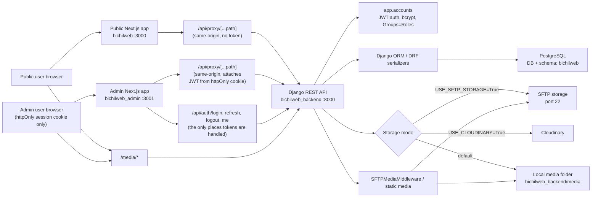
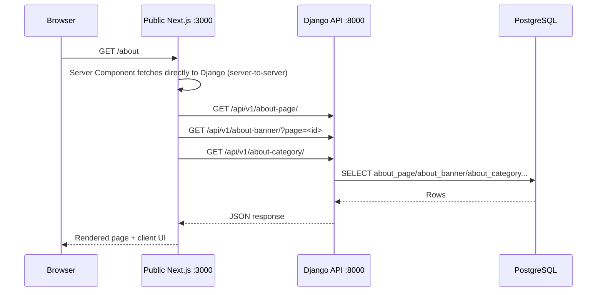
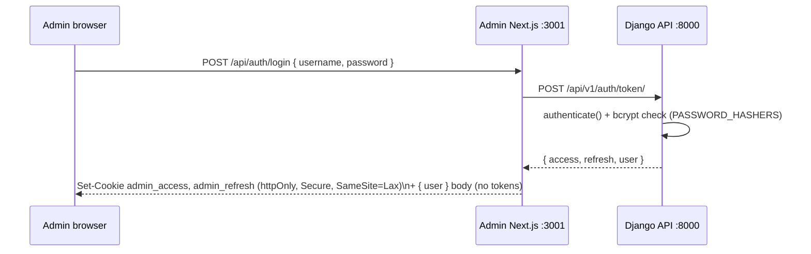
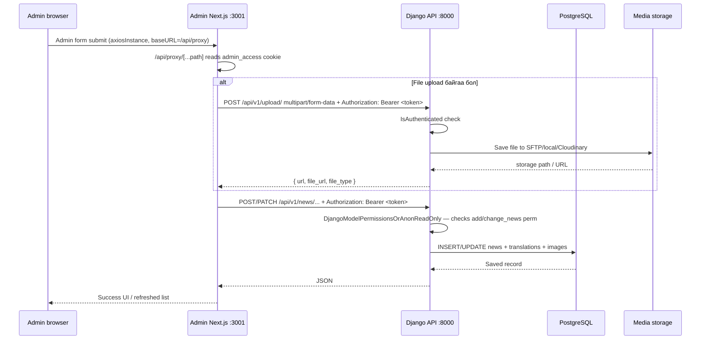
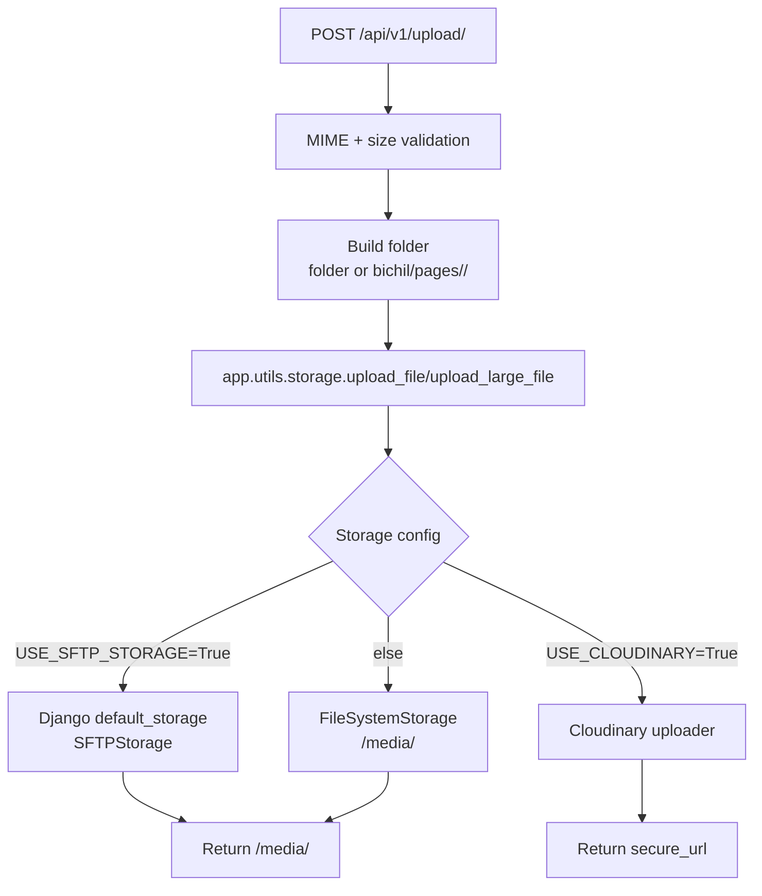
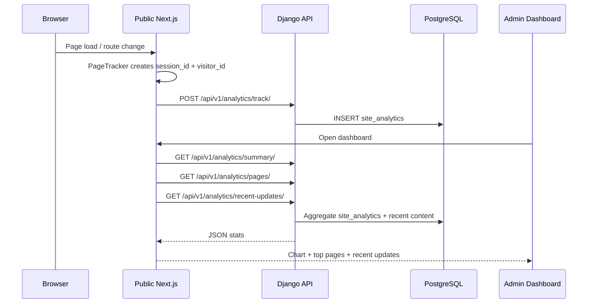

# Bichil Globus Website Architecture Handover

Энэ баримт нь сайтыг хүлээлгэн өгөхөд зориулсан техникийн архитектурын тайлбар юм. Мэргэжлийн хүн харахад аль хэсэг хаана ажилладаг, хүсэлт хаанаас хаашаа явдаг, зураг/өгөгдөл хаана хадгалагддагийг хурдан ойлгохоор бүтэцлэв.

## 1. Товч Дүгнэлт

| Хэсэг | Folder | Tech stack | Dev port | Үүрэг |
|---|---|---:|---:|---|
| Хэрэглэгчийн сайт | `bichilweb/` | Next.js 16, React 19, Tailwind | `3000` | Нүүр хуудас, бүтээгдэхүүн, мэдээ, бидний тухай, HR, branch гэх мэт public UI |
| Админ CMS | `bichilweb_admin/` | Next.js 16, React 19, Tailwind | `3001` | Header/footer/banner/news/page-builder/product/HR/ads/dashboard удирдлага |
| Backend API | `bichilweb_backend/` | Django 6, DRF, PostgreSQL | `8000` | REST API, upload, analytics, DB model, media serve/cache |
| Database | External PostgreSQL | PostgreSQL schema `bichilweb` | `5432` | CMS болон public сайтын бүх dynamic өгөгдөл |
| Media storage | SFTP / local / Cloudinary fallback | Django `default_storage` | `22` SFTP | Зураг, video, document хадгалалт |

## 2. Ерөнхий Архитектур



**Neither frontend calls Django directly from the browser anymore.** Both apps route every request through their own same-origin `/api/proxy/[...path]` route handler (`bichilweb/src/app/api/proxy/[...path]/route.ts`, `bichilweb_admin/src/app/api/proxy/[...path]/route.ts`), which forwards server-side to `BACKEND_API_URL`. This is a Backend-for-Frontend (BFF) pattern: Django's real address never appears in the browser bundle, and for the admin app it's also the only place the session's bearer token gets attached — the token itself lives only in an httpOnly cookie, never in browser JavaScript or localStorage.

## 3. Request Flow: Public Website Data Унших

Жишээ: хэрэглэгч `http://localhost:3000/about` нээхэд:



Client components that still fetch after the page loads (interactive widgets, the About tabs, the loan calculator) go through the same-origin `bichilweb/src/app/api/proxy/[...path]/route.ts`, which forwards to Django server-side — the browser never holds `NEXT_PUBLIC_API_URL`/Django's address for actual data calls. Server Components and route handlers (which never ship to the browser) call Django directly, which is the same code path but without the extra hop, resolved automatically by `bichilweb/src/lib/apiBase.ts`'s `getApiBase()` (proxy in the browser, direct URL on the server). A couple of routes are Next-side logic of their own, not pure proxies:

| Public route | Backend рүү очих endpoint | Үүрэг |
|---|---|---|
| `bichilweb/src/app/api/analytics/route.ts` | `/api/v1/analytics/track/` | Page view tracking |
| `bichilweb/src/app/api/rates/route.ts` | `/api/v1/exchange-rate-config/` + external rate URL | Валютын ханш (has its own in-memory TTL cache on top) |
| `bichilweb/src/app/api/header/route.ts` | `/api/v1/headers/` | Толгой хэсгийн тохиргоо |

## 4. Request Flow: Login and Admin Save / Update

### 4.1 Login



The access/refresh JWTs (`djangorestframework-simplejwt`) never reach browser JavaScript — they're set as httpOnly cookies by `bichilweb_admin/src/app/api/auth/login/route.ts` and read back out by `src/lib/session.ts` on the server for every subsequent request. `src/middleware.ts` gates `/`, `/admin/*`, and the API routes on cookie *presence* only (a cheap edge check for UX); Django is the authority on whether the token is actually valid, and a 401 from Django triggers a one-shot silent refresh (`/api/auth/refresh`) via the client-side axios interceptor (`src/lib/axios.tsx`), falling back to a redirect to `/login`.

### 4.2 Save / Update

Жишээ: админ мэдээ хадгалах үед:



Every admin data call goes through **one** path now: `axiosInstance` (`bichilweb_admin/src/lib/axios.tsx`, baseURL `/api/proxy`) → `bichilweb_admin/src/app/api/proxy/[...path]/route.ts` → Django, with the bearer token attached server-side via `src/lib/session.ts`'s `djangoFetch`. The browser never holds the token and never talks to Django directly. A handful of older, hand-written proxy routes (`/api/admin/header-menu`, `/api/call-button`, `/api/analytics/*`, etc.) still exist for endpoints with Next-side transformation logic (format conversion, multi-step saves) — these also attach the token the same way, just without going through the generic catch-all.

### 4.3 Authorization model

- **Authentication**: JWT (`djangorestframework-simplejwt`), issued by `app.accounts`. Passwords hashed with bcrypt (`PASSWORD_HASHERS` in `settings.py`).
- **Roles**: Django's built-in `Group`/`Permission` tables. "Super Admin" = `is_superuser=True` (bypasses all permission checks). Other roles are Groups with specific model permissions attached, managed via **Хэрэглэгчид / Эрхийн түвшин** in the admin sidebar (Super Admin only).
- **Per-endpoint enforcement**: reviewed per Django view — public content uses `DjangoModelPermissionsOrAnonReadOnly` (anonymous read, permissioned write); admin-only data (analytics, generic upload, user/role management) requires `IsAuthenticated`/`IsSuperAdmin` even to read; public submission forms (loan requests, job applications) allow anonymous *create* but require staff login to list/read the submitted data.

## 5. Upload / Media Storage Flow

Upload entrypoint:

```text
POST /api/v1/upload/
field: file
optional fields: folder, page_slug, slug, page, url
```

Storage шийдэх дараалал:



Important files:

| File | Үүрэг |
|---|---|
| `bichilweb_backend/app/views/upload.py` | Upload API, MIME/size шалгалт, folder сонголт |
| `bichilweb_backend/app/utils/storage.py` | Cloudinary/SFTP/local storage helper |
| `bichilweb_backend/app/sftp_middleware.py` | `GET /media/*` үед SFTP-с file уншиж browser-т буцаана |
| `bichilweb_backend/bichilglobusweb/settings.py` | `STORAGES`, `USE_SFTP_STORAGE`, `USE_CLOUDINARY`, `MEDIA_URL` тохиргоо |

SFTP ашиглах бол backend `.env` дээр:

```env
USE_SFTP_STORAGE=True
SFTP_STORAGE_HOST=...
SFTP_STORAGE_PORT=22
SFTP_STORAGE_ROOT=/bichilglobus/media/
SFTP_STORAGE_USER=...
SFTP_STORAGE_PASS=...
```

SFTP ажиллахын тулд backend server-ээс `SFTP_STORAGE_HOST:22` руу network/firewall/VPN нээлттэй байх ёстой.

Render deploy дээр SFTP ашиглахгүй, Cloudinary хэвээр ашиглах бол:

```env
USE_SFTP_STORAGE=False
SFTP_STORAGE_HOST=
CLOUDINARY_CLOUD_NAME=...
CLOUDINARY_API_KEY=...
CLOUDINARY_API_SECRET=...
```

Ингэснээр upload helper Cloudinary-г сонгоно. Render-д зориулсан дэлгэрэнгүй заавар: `RENDER_DEPLOY_CLOUDINARY_GUIDE.md`.

## 6. Backend API Structure

Бүх үндсэн API `/api/v1/` prefix-тэй.

| Endpoint group | Main files | Үүрэг |
|---|---|---|
| Header / hero / CTA / partners / stats / ads | `app/urls.py`, `app/views/*` | Нүүр хуудас болон site-wide тохиргоо |
| Product | `app/product/` | Бүтээгдэхүүн, төрөл, баримт бичиг, нөхцөл |
| Services | `app/services/` | Үйлчилгээний хуудас, card, collateral, document |
| News | `app/news/` | Мэдээ, ангилал, title/content/shortdesc translations |
| About | `app/aboutpage/`, `app/aboutbanner/`, `app/about_category/`, `app/management/`, `app/mgmt_category/` | Бидний тухай, засаглал, удирдлага, category |
| Utilities | `app/utilities/` | Pages, branches, footer, floating menu, HR, jobs |
| Analytics | `app/analytics/` | Page tracking, dashboard summary/pages/recent updates |
| Calculator / rates | `app/calculator/`, `app/exchangerate/` | Зээлийн тооцоолуур, валютын ханш тохиргоо |
| Loan request / CV | `app/loanrequest/`, `CvApplicationViewSet` | Хүсэлт илгээх, анкет |
| Auth / Users / Roles | `app/accounts/` | `POST auth/token/` (login), `auth/token/refresh/`, `auth/token/blacklist/` (logout), `auth/me/`, `auth/change-password/`, `accounts/users/` (Super Admin only), `accounts/roles/` (Super Admin only), `accounts/permissions/` (permission catalogue for the Role Management UI) |

Live API reference: once `drf-spectacular` is installed (see §6.1), an auto-generated OpenAPI schema is available at `/api/schema/`, Swagger UI at `/api/docs/`, and Redoc at `/api/redoc/` — this is the authoritative, always-current endpoint list; the table above is a map of *where the code lives*, not a full endpoint enumeration.

### 6.1 API Documentation (Swagger / OpenAPI)

`bichilweb_backend` uses `drf-spectacular` to generate its API docs directly from the DRF viewsets/serializers, rather than a hand-written reference that goes stale on the next model change:

- `/api/schema/` — raw OpenAPI 3 schema (importable straight into Postman: *Import → Link*).
- `/api/docs/` — Swagger UI.
- `/api/redoc/` — Redoc (better for a printed/shared reference).

These are unauthenticated by design (the schema itself isn't sensitive — it's just method/field shapes), matching every other public read on this backend.

## 7. Analytics Flow

Public site дээр page солигдох бүрд:



Dashboard date grouping нь `Asia/Ulaanbaatar` timezone-р тооцогдоно.

## 8. Cache / Performance

Backend middleware:

| Middleware | Үүрэг |
|---|---|
| `PublicApiCacheMiddleware` | `/api/v1/*` GET JSON response-уудыг богино хугацаанд cache хийж public site хурдлуулна. POST/PATCH/DELETE амжилттай бол cache clear хийнэ. |
| `SFTPMediaMiddleware` | SFTP storage идэвхтэй үед `/media/*` file-г SFTP-с уншиж `inline` response болгон буцаана. |
| `WhiteNoiseMiddleware` | Django static file serve/compression |

Frontend тал:

| App | Cache хэлбэр |
|---|---|
| `bichilweb` | Зарим server fetch дээр `revalidate`, зарим client fetch direct API |
| `bichilweb_admin` | Ихэнх admin data `no-store` буюу fresh data |

## 9. Environment Variables

Backend `.env` гол хувьсагчууд:

```env
SECRET_KEY=...
DEBUG=False
ALLOWED_HOSTS=127.0.0.1,localhost,example.mn
CORS_ALLOWED_ORIGINS=http://localhost:3000,http://localhost:3001,https://example.mn
CORS_ALLOW_ALL_ORIGINS=False

DB_NAME=...
DB_USER=...
DB_PASSWORD=...
DB_HOST=...
DB_PORT=5432
DB_SSL=False

USE_SFTP_STORAGE=True
SFTP_STORAGE_HOST=...
SFTP_STORAGE_PORT=22
SFTP_STORAGE_ROOT=/bichilglobus/media/
SFTP_STORAGE_USER=...
SFTP_STORAGE_PASS=...

CLOUDINARY_CLOUD_NAME=...
CLOUDINARY_API_KEY=...
CLOUDINARY_API_SECRET=...
```

Public frontend `.env.local`:

```env
NEXT_PUBLIC_API_URL=http://127.0.0.1:8000/api/v1
NEXT_PUBLIC_MEDIA_URL=http://127.0.0.1:8000
BACKEND_API_URL=http://127.0.0.1:8000/api/v1
BACKEND_URL=http://127.0.0.1:8000
```

Admin `.env.local`:

```env
NEXT_PUBLIC_API_URL=http://127.0.0.1:8000/api/v1
NEXT_PUBLIC_MEDIA_URL=http://127.0.0.1:8000
BACKEND_API_URL=http://127.0.0.1:8000/api/v1
BACKEND_URL=http://127.0.0.1:8000
```

Production дээр эдгээрийг actual domain руу солино.

**Auth-тай холбоотой env vars:** SimpleJWT-ийн тохиргоо (`SIMPLE_JWT` in `settings.py`) одоо байгаа `SECRET_KEY`-г л ашигладаг тул шинэ env var шаардахгүй. `admin_access`/`admin_refresh` cookie нэрс, `PASSWORD_HASHERS` (bcrypt-first) зэрэг нь бүгд code дотор тохируулагдсан, env-ээс биш. `ADMIN_USERNAME`/`ADMIN_PASSWORD` гэсэн хуучин Basic Auth env var-ууд бүрмөсөн хасагдсан (`bichilweb_admin/src/middleware.ts` дахин бичигдсэн) — эдгээрийг цаашид тохируулах шаардлагагүй.

## 10. Local Run Commands

Backend:

```powershell
cd bichilweb_backend
.\.venv\Scripts\python.exe manage.py migrate
.\.venv\Scripts\python.exe manage.py create_admin   # first run only — bootstraps the first Super Admin
.\.venv\Scripts\python.exe manage.py runserver 0.0.0.0:8000
```

Public site:

```powershell
cd bichilweb
npm run dev
```

Admin:

```powershell
cd bichilweb_admin
npm run dev
```

Root script:

```powershell
.\start-all.ps1
```

## 11. Production Build Commands

Public site:

```powershell
cd bichilweb
npm install
npm run build
npm run start
```

Admin:

```powershell
cd bichilweb_admin
npm install
npm run build
npm run start
```

Backend:

```powershell
cd bichilweb_backend
.\.venv\Scripts\python.exe manage.py migrate
.\.venv\Scripts\python.exe manage.py collectstatic
gunicorn bichilglobusweb.wsgi:application
```

Windows IIS/PM2/NSSM/nginx reverse proxy зэрэг ашиглаж болно. Гол нь public app, admin app, Django backend 3 service тусдаа асаалттай байна.

## 12. Network / Firewall Requirements

| From | To | Port | Why |
|---|---|---:|---|
| Browser | Public Next app | `3000` or HTTPS `443` | Хэрэглэгчийн сайт |
| Browser | Admin Next app | `3001` or HTTPS `443` | Админ CMS |
| Public/Admin app | Django backend | `8000` or internal API port | REST API |
| Django backend | PostgreSQL | `5432` | DB read/write |
| Django backend | SFTP server | `22` | Media upload/read |
| Browser | Django `/media/*` | backend public port | Зураг/video/media харах |

## 13. Security Notes

**Login protection — RESOLVED.** This section used to say the admin CMS had no real login protection and needed one added. It now has a full JWT + RBAC system: bcrypt-hashed passwords stored in the database (not `.env`), Django Groups/Permissions as roles, a Super Admin-only User & Role management UI, httpOnly-cookie sessions, and every content-management endpoint reviewed for the correct permission (see §4.3). The old HTTP Basic Auth with a hardcoded `admin`/`password` fallback is gone. Bootstrap the first Super Admin with `python manage.py create_admin` (see §10).

**Public upload endpoint — RESOLVED.** `POST /api/v1/upload/` (`app/views/upload.py`) now requires `IsAuthenticated` — there is no legitimate anonymous use of a generic file-upload endpoint, and previously anyone on the internet could upload arbitrary files to storage.

**A caching bug was found and fixed**: `PublicApiCacheMiddleware` used to cache *any* successful GET response under `/api/v1/` purely by URL path, with no awareness of who made the request — so an authenticated response (e.g. the logged-in user's own profile) could be cached and replayed to the next visitor, including an anonymous one, for up to `PUBLIC_API_CACHE_TIMEOUT` seconds. It now skips the cache entirely whenever a request carries an `Authorization` header (see `app/public_api_cache.py`).

Still true / general hygiene:

- `SECRET_KEY`, DB password, SFTP password, Cloudinary secret, AWS keys зэргийг repo-д commit хийхгүй. **`bichilweb_backend/.env.example` нэг удаа real AWS access key агуулж байсныг олж, placeholder-оор сольсон болно — хэрэв тэр key хараахан rotate хийгээгүй бол AWS console-оос нэн даруй rotate хийнэ үү.**
- Production дээр `DEBUG=False` байх ёстой.
- `ALLOWED_HOSTS`, `CORS_ALLOWED_ORIGINS` production domain-уудаар хязгаарлагдсан байх ёстой.
- SFTP port 22 зөвхөн backend server IP-с нээгдсэн байвал илүү аюулгүй.
- `app/migrations_backup/` нь `INSTALLED_APPS`-д байхгүй, идэвхгүй folder — санаатай нөөц хуулбар эсэхийг шалгаад хэрэггүй бол устгаж болно (одоогоор хэн ч устгаагүй, зөвхөн энд тэмдэглэв).

## 14. Handover Checklist

- [ ] Backend `.env` production утгууд зөв эсэх
- [ ] Frontend/Admin `.env.local` production API/media URL зөв эсэх
- [ ] PostgreSQL connection ажиллаж байгаа эсэх
- [ ] `python manage.py migrate` бүрэн гүйсэн эсэх
- [ ] SFTP port 22 backend server-с reachable эсэх
- [ ] Upload test: image upload -> `/media/...` URL browser дээр нээгдэж байгаа эсэх
- [ ] Public homepage, about, product, news, HR, branch хуудсууд нээгдэж байгаа эсэх
- [ ] Admin save/update хийсний дараа public site дээр cache clear болж шинэ data харагдаж байгаа эсэх
- [ ] Dashboard analytics tracking `site_analytics` table-д бичигдэж байгаа эсэх
- [ ] Production `DEBUG=False`, CORS/ALLOWED_HOSTS зөв эсэх
- [ ] `python manage.py create_admin` ажиллуулж эхний Super Admin үүссэн эсэх
- [ ] Super Admin-аар нэвтэрч, Role Management-с "Admin" role-д хэрэгтэй permission олгосон эсэх (bootstrap үед бүх permission автоматаар олгогддог)
- [ ] `/api/v1/upload/`, `/api/v1/accounts/*`, analytics endpoint-үүд нэвтрээгүй хэрэглэгчид 401 буцааж байгааг шалгах

## 15. Quick Troubleshooting

| Шинж тэмдэг | Боломжит шалтгаан | Шалгах зүйл |
|---|---|---|
| Admin хадгалах үед 500 | Backend migration дутуу, DB column/table байхгүй | `python manage.py migrate`, backend console traceback |
| Зураг upload болохгүй | SFTP/VPN/firewall, storage env буруу | `SFTP_STORAGE_HOST`, `PORT 22`, username/password |
| Зураг upload болсон ч харагдахгүй | `/media/*` serve тохиргоо, SFTP middleware | `GET /media/<path>`, backend log |
| Public site data хоосон | API URL буруу эсвэл CORS | `NEXT_PUBLIC_API_URL`, browser Network tab |
| Dashboard тоо гарахгүй | Analytics track орохгүй эсвэл DB хоосон | `/api/v1/analytics/track/`, `site_analytics` table |
| Admin proxy route 500 | `BACKEND_API_URL`/`BACKEND_URL` буруу | Admin server logs |
| Admin login 401 | Хэрэглэгч байхгүй/идэвхгүй, эсвэл нууц үг буруу | Django-с `create_admin` ажилласан эсэх, `is_active` талбар |
| Нэвтэрсэн ч 403 гарч байна | Тухайн role-д хэрэгтэй permission олгогдоогүй | Role Management-с role-ийн permission шалгах |
| Admin хуудас руу орохоор `/login` руу үргэлж шидэгдэнэ | `admin_access` cookie тохирохгүй байна (secure cookie нь HTTPS шаарддаг) | `NODE_ENV=production` үед сайт HTTPS дээр ажиллаж байгаа эсэх |

## 16. Гол Code Entry Points

| Path | Яагаад чухал вэ |
|---|---|
| `bichilweb/src/app/page.tsx` | Public homepage composition |
| `bichilweb/src/components/PageTracker.tsx` | Analytics tracking |
| `bichilweb/src/lib/axios.tsx` | Public axios base (baseURL resolves via `src/lib/apiBase.ts`) |
| `bichilweb/src/app/api/proxy/[...path]/route.ts` | Public site's BFF proxy to Django |
| `bichilweb/src/actions/`, `bichilweb/src/types/` | Typed data-fetching functions + DTOs (see `actions/news.ts` as the reference example) |
| `bichilweb_admin/src/app/page.tsx` | Admin dashboard |
| `bichilweb_admin/src/components/admin/VisitorsChart.tsx` | Dashboard chart/top pages |
| `bichilweb_admin/src/app/api/analytics/*` | Dashboard proxy API |
| `bichilweb_admin/src/lib/session.ts` | Server-only session layer — `getCurrentUser`, `djangoFetch` |
| `bichilweb_admin/src/app/api/proxy/[...path]/route.ts` | Admin's authenticated BFF proxy to Django |
| `bichilweb_admin/src/app/api/auth/*` | Login/refresh/logout/me route handlers — the only places tokens are set/read |
| `bichilweb_admin/src/actions/`, `bichilweb_admin/src/types/auth.ts` | Typed actions + DTOs (auth, users, roles) |
| `bichilweb_admin/src/middleware.ts` | Session cookie gate for `/`, `/admin/*`, protected API routes |
| `bichilweb_backend/bichilglobusweb/settings.py` | DB, CORS, storage, middleware, JWT/`PASSWORD_HASHERS` config |
| `bichilweb_backend/bichilglobusweb/urls.py` | Main API routing |
| `bichilweb_backend/app/models/models.py` | Database model mapping |
| `bichilweb_backend/app/accounts/` | Auth, User & Role management (JWT, bcrypt, Groups/Permissions) |
| `bichilweb_backend/app/analytics/views.py` | Analytics endpoints |
| `bichilweb_backend/app/views/upload.py` | Upload endpoint (now `IsAuthenticated`) |
| `bichilweb_backend/app/utils/storage.py` | Storage abstraction |
| `bichilweb_backend/app/public_api_cache.py` | Public GET response cache (bypassed for authenticated requests) |
